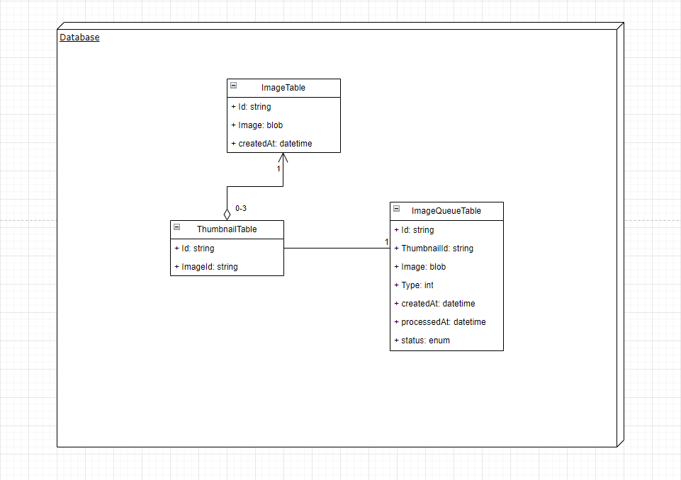
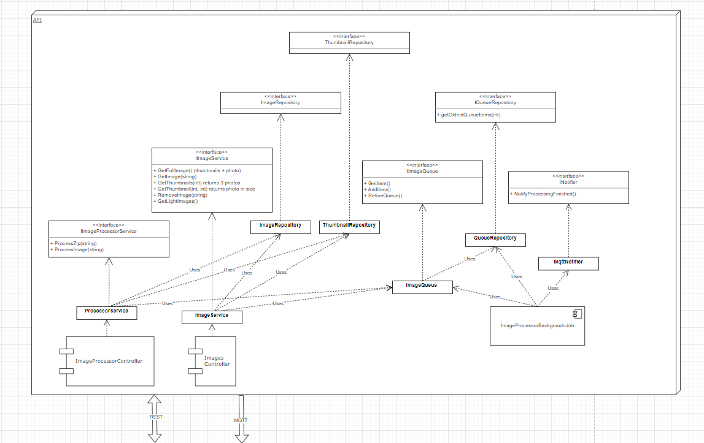
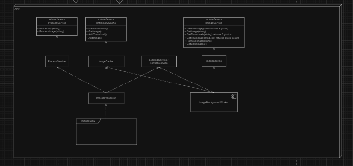
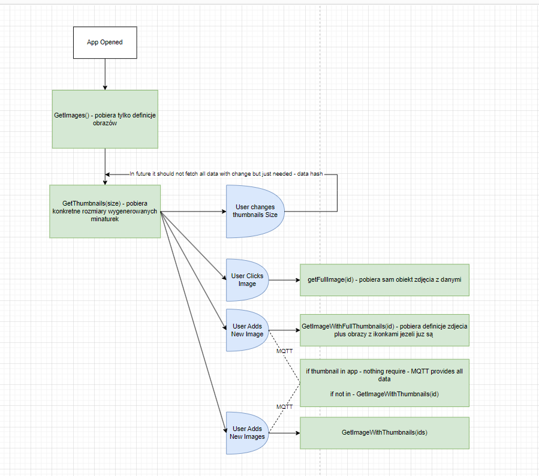

# Overall Informations

In order to start api, first you need to stard docker postgres container using ```docker up -d```.
Dockerfile definition is in root directory.
Then just start InteliJ project.

In order to start integration tests you must have docker container.

## Milestone 1

### Changelog Lab 1

+ Background task for processing images
+ Queue
+ Service and controller for processing
+ Repositoreis for Models
+ Models 
+ App Setup and basic Idea
+ docker container

All screenshots below can be found in ArchitectureSketch.drawio

Errors found to fix:
- handling situation when image processing fails

#### Database



#### API



#### APP



### Changelog Lab 2

+ ImageTester - small app to quickly change base64 to image and image to base64
+ MQTTNotifier
+ fixed: handling situation when processing fails
+ simple logging
+ endpoint for processing multiple files
+ added ImageController (gets and remove)
+ added basic UnitTests

Errors found to fix:
- when added invalid image it is processed validly but cannot fetch data due tu error

### MS1 Fix
+ UnitTests for BackgroundProcess
+ IntegrationTests for Processing feature
+ CleanCode Fixes


## Milestone 2

### Changelog Lab 4 and 5

+ ImageController - integration tests
+ creating 3 thumbnails on image creation
+ reworked ImageController
+ success and fail MQTT notifications just with thumbnailId
+ simplified app flow that can be accessed in AppFlow.drawio
+ contenerize api server

### MS2 Fix
+ Took out dtos from services
+ provided Error class to represent erros in servbices (added to result class)
+ testing if mqtt messages are incoming when processing images
+ provided basic validation in image controller when getting images
+ simplified ThumbnailSize class 
+ fix UI
+ fully connect frontend with api (MQTT connection included)

#### Simplified App Flow



## Milestone 3

+ pagination for thumbnails without folder
+ pagination for thumbnails with folder
+ processing includes folders
+ folders logic
front:
+ drag&dropping zipped folders
+ sending and receiving sent zips
+ separate column for paths

### Changelog Lab 5

### Changelog Lab 6